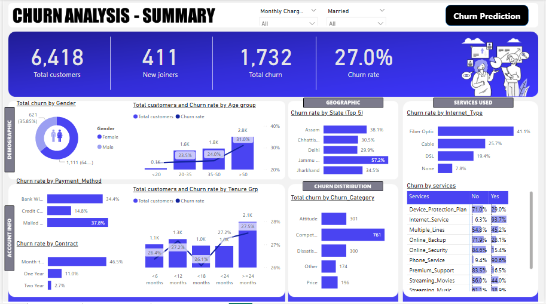
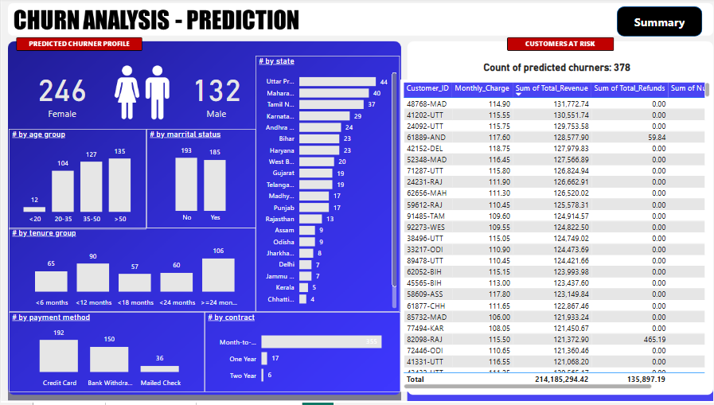

# Customer Churn Analysis | Power BI, SQL & Machine Learning
This project demonstrates a **complete end-to-end churn analysis pipeline** integrating **SQL Server**, **Power BI**, and **Python (Machine Learning)**.  
It follows a real-world data analytics workflow — from **data extraction and cleaning** to **predictive modeling and dashboard visualization**.

The goal is to identify and visualize **customer churn patterns**, predict potential churners, and provide **actionable insights** for business decisions through interactive Power BI dashboards.

---

## 🧩 Tools & Technologies Used
- **SQL Server** – Data extraction (ETL), cleaning, and transformation  
- **Power BI** – Data modeling, DAX measures, and dashboard visualization  
- **Python (Jupyter Notebook)** – Machine Learning (Random Forest Classifier)  
- **Anaconda** – Environment & dependency management  

---

## 🚀 Project Workflow
1. **ETL Process in SQL Server** – Extract, transform, and load raw customer data  
2. **Data Cleaning** – Handle missing values, duplicates, and inconsistent data types  
3. **Power BI Data Modeling** – Create relationships and calculated measures  
4. **Power BI Visualization** – Develop interactive dashboards and insights  
5. **Machine Learning Model (Python)** – Build a Random Forest Classifier for churn prediction  
6. **Churn Prediction Dashboard** – Import predicted churn results into Power BI for visualization  
---

## 🧠 Machine Learning Component
- **Algorithm:** Random Forest Classifier  
- **Objective:** Predict customer churn using behavioral and demographic features  
- **Integration:** Predictions imported into Power BI for business visualization  

---

## 📈 Power BI Dashboard Features

### 1️⃣ **Churn Analysis - Summary Page**

 
**Key Insights:**
- Displays overall churn metrics such as total customers, churn count, churn rate, and new joiners  
- Visualizes churn patterns by **gender**, **age group**, **payment method**, and **contract type**  
- Includes geographic churn rate by **state** and service-based churn insights (e.g., Internet type, plan type)  
- Helps identify **key churn drivers** and retention opportunities

The summary dashboard shows a 27% churn rate out of 6,418 customers, with churn concentrated in month-to-month contracts, fiber-internet users, and customers aged 45–60. States like California and Oregon show the highest churn levels, and payment methods such as bank withdrawal and credit card also carry higher churn. Service-related churn is especially linked to Internet Service and add-on features like Device Protection and Multiple Lines, highlighting contract type and service experience as the main churn drivers.

---

### 2️⃣ **Churn Analysis - Prediction Page**

 
**Key Insights:**
- Presents a detailed profile of **predicted churners** using the Random Forest model  
- Segments churners by **state**, **tenure**, **contract**, **payment method**, and **age group**  
- Displays total count of predicted churners and allows filtering to identify **high-risk customers**  
- Enables data-driven strategies for **targeted retention campaigns**

The model predicts 378 churners, mostly female, mid-aged, and mid-tenure customers, with credit card users forming the largest group. States like Maharashtra and Karnataka show the highest churn counts, and predicted churners generate roughly $214M in revenue, making them a high-value at-risk segment worth prioritizing for retention.

## 💡 Key Skills Demonstrated
- Data preprocessing and transformation using **SQL Server**
- Data modeling, **DAX measures**, and Power BI dashboarding
- Machine learning model building with **Python (Random Forest)**
- Integration of predictive results into **interactive business dashboards**
